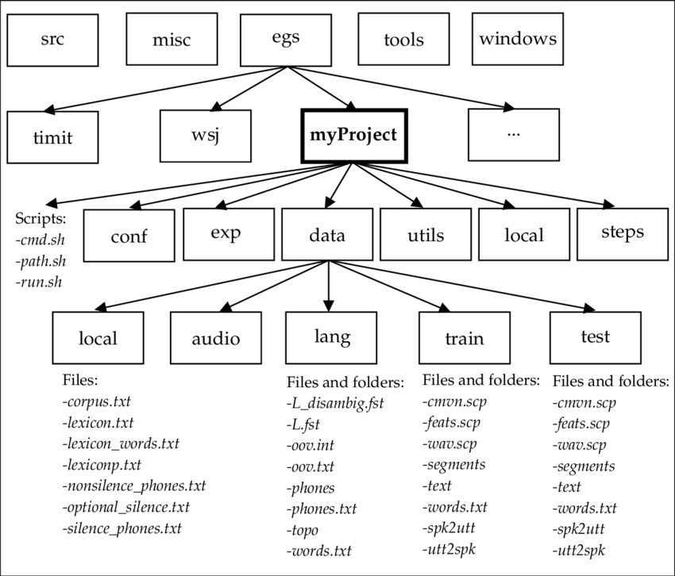
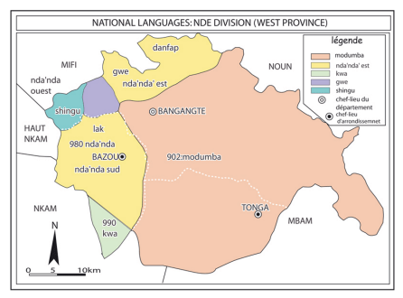
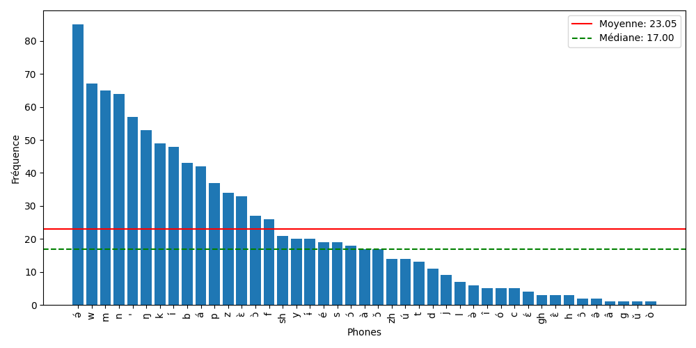
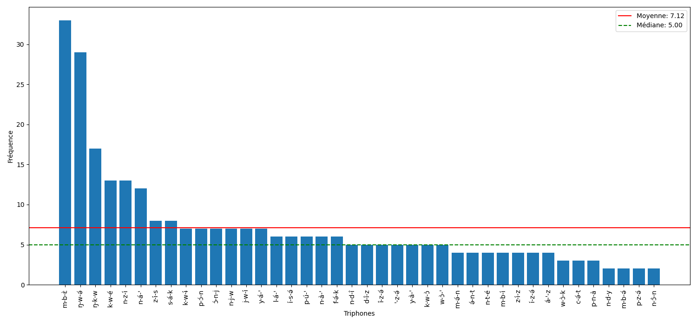
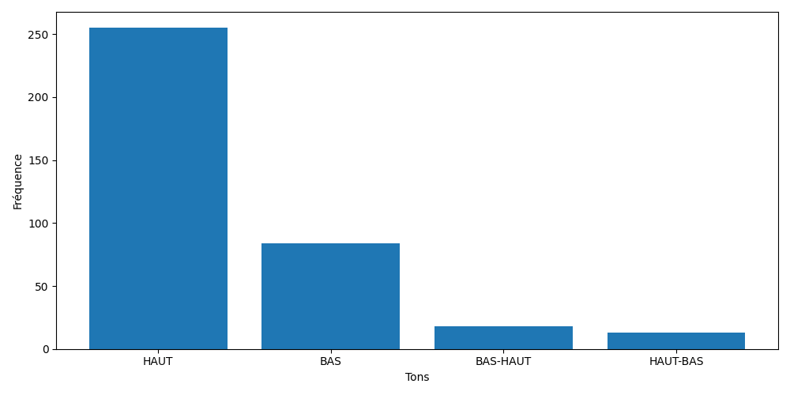

# Acoustic Model Training and Evaluation

This project provides scripts for training and evaluating acoustic models using monophones and triphones with various configurations. The scripts handle data preparation, feature extraction, model training, alignment, and evaluation. For data on the language [Nda' Nda'](https://drive.google.com/drive/folders/1tY8o_-wLLheOs6_wHTcrOhRNXHpD0dI0?usp=drive_link).

## Table of Contents

- [Project Structure](#project-structure)
- [Requirements](#requirements)
- [Installation](#installation)
- [Configuration](#configuration)
- [Usage](#usage)
- [Nda' Nda'](#nda-nda)
- [Experiments](#experiments)
- [Scripts Overview](#scripts-overview)
- [Training Configuration](#Configuration)
- [Key references](#keys-references)
- [Contributing](#contributing)
- [License](#license)

## Project Structure
```
configs/
    └── Config.json
evaluation/
    ├── evaluation.sh
    └── make_graph.sh
feature_extractions/
    └── features_extractions.sh
logs/
    └── error.log
main.sh
README.md
requirements.sh
requirements.txt
training/
    ├── acoustic_model/
    └── language_model/
Utils/
    ├── data_preparation/
    ├── init_kaldi_projet_structure/
    ├── phone_statistics/
    │   └── phone_statistics.sh
    ├── utils.sh
    ├── view_ark_file.py
    └── word_count_occurence.py
```

## Requirements

- Kaldi
- Python 3.x
- NumPy
- Matplotlib
- etc
- Check the `requirements.txt` and `requirements.sh` for more details


## Installation
1. Ensure Kaldi is installed and properly configured. Follow the [Kaldi installation guide](http://kaldi-asr.org/doc/install.html) for detailed instructions.

2. Clone the repository:
    ```sh
    git clone https://github.com/mende237/Nda-Nda-Force-Aligner.git
    cd Nda-Nda-Force-Aligner
    ```

3. Install the required Python packages to your Python virtual environment:
    ```sh
    pip install -r requirements.txt
    ```
 
3. shell dependencies  
    Install `jq`:
    ```sh
    sudo apt-get install jq
    ```
    or ensure that the `requirements.sh` file has execution rights and run:
    ```sh
    chmod +x requirements.sh
    ./requirements.sh
    ```


## Configuration

### Configuring `Config.json`

The `Config.json` file contains paths to your Kaldi installation and Python virtual environment. Here is an example configuration:

```json
{
    "kaldi_installation_path" : "/home/dimitri/kaldi",
    "python_virtual_environement_path" : "/home/dimitri/NdaNdaForceAligner/myvenv"
}
```

### Setting Environment Variables

To set the Kaldi installation path as an environment variable, add the following line to your `~/.bashrc` file, replacing the path with your own Kaldi installation path:

```sh
echo 'export KALDI_INSTALLATION_PATH="/home/dimitri/kaldi"' >> ~/.bashrc
```

## Usage

1. Prepare your data by placing it in the appropriate directories. You can get the data by using this [link](https://drive.google.com/drive/folders/1tY8o_-wLLheOs6_wHTcrOhRNXHpD0dI0?usp=drive_link). Inside this drive folder, you will find two folders: `mono` and `stereo`. The `mono` folder contains audio data with one channel, and the `stereo` folder contains the same data with two channels. It is recommended to use the `mono` data.
2. Run the `initialize.sh` script located in the `init_kaldi_projet_structure/` folder. Change the directory to `init_kaldi_projet_structure/` and run the command below, where `<project_name>` is the name of the folder that will contain all the data in Kaldi format:

    ```sh
    ./initialize.sh <project_name>
    ```
    <p align="center">
        
    </p>

3. Configure the `main.sh` script with your project-specific settings. For the beginning, you must only configure the project folder path and data root folder path. Inside this file, there is one variable named `project_name`. Set this variable with your `<project_name>`. Check also the variable named `data_root` and set it to the data root you downloaded using this [link](https://drive.google.com/drive/folders/1tY8o_-wLLheOs6_wHTcrOhRNXHpD0dI0?usp=drive_link). Example:

```sh
data_root="/home/dimitri/Documents/memoire/data/mono"
project_name="test_MFCC_pitch_tone_1_2"
```

**NB:** The path to data is the one that directly leads to the folder containing the file named `utterance.txt`.

4. Run the main script:
    ```sh
    ./main.sh
    ```
This command will automatically perform all tasks from data preparation to evaluation, including feature extraction and model training (acoustic and language models). Four acoustic models will be trained:
- Monophone HMM
- Triphone HMM
- Triphone HMM + SAT
- Hybrid HMM-DNN

The training results will be stored respectively in the following files:
- `YOUR_KALDI_INSTALLATION_PATH/egs/PROJECT_NAME/exp/train_mono_50_per_spk/decode/scoring_kaldi/best_wer`
- `YOUR_KALDI_INSTALLATION_PATH/egs/PROJECT_NAME/exp/train_tri_delta_delta_50_per_spk/decode/scoring_kaldi/best_wer`
- `YOUR_KALDI_INSTALLATION_PATH/egs/PROJECT_NAME/exp/train_tri_sat_50_per_spk/decode/scoring_kaldi/best_wer`
- `YOUR_KALDI_INSTALLATION_PATH/egs/PROJECT_NAME/exp/tri4_nnet/decode/scoring_kaldi/best_wer`

The evaluation metric is WER (Word Error Rate).
## Nda' Nda'
The **Nda' Nda'** language is spoken in the Western region of Cameroon, spread across four departments: Ndé, with the villages of Bangoua, Bamena, Balengou, Bazou, and Batchingou; Hauts-Plateaux, with the villages of Bangou, Batoufam, and Bandrefam; Koung-Khi, with the villages of Bangang-Fongang and Bangang-Fondji; and Haut-Nkam, with the village of Batcha. In 1990, the number of speakers was estimated to be 10,000 [source](https://fr.wikipedia.org/wiki/Nda'nda'). It is a tonal language composed of four tones: **"high" (ˊ), "low" (ˋ), "low-high" (ˇ), and "high-low" (ˆ)**. For example, kwé translates to "eaten," mbɛ̀ translates to "meat," and kúndyə̂ translates to "bed."

<p align="center">
    
</p>


## Experiments

### Feature Extractions

In speech processing, the choice of features is crucial for the performance of speech recognition systems. While several features can be considered, there are reasons for favoring certain features over others, such as MFCCs, pitch, and delta and delta-delta parameters with CMVN applied. CMVN, a combination of CMN and CVN, normalizes recording environment variations like volume and noise changes, enhancing the robustness of speech recognition models.

- **MFCC**: These coefficients are widely used in speech processing due to their ability to compactly represent spectral information and simulate human sound perception. They effectively capture timbre and tone variations, making them suitable for ASR systems.
- **Pitch**: As shown by Ghahremani et al. (2014), pitch features can be useful for ASR systems, especially for tonal languages like Vietnamese and Cantonese. Ignoring this feature could result in the loss of crucial information, particularly in linguistic contexts where tone changes word meanings.
- **Delta and Delta-Delta**: In addition to spectral coefficients, first-order (delta) and second-order (delta-delta) regression coefficients are added to heuristically compensate for the conditional independence assumption made by HMM-based acoustic models.

The dimension of the acoustic coefficient vector extracted from recording frames is 13. When combining MFCCs with pitch features, the number of MFCC coefficients was reduced to 10 to maintain a dimension of 13 with the addition of three pitch-related coefficients. This dimension was empirically determined during experiments, as performance was poor beyond 13. With the addition of delta and delta-delta derived coefficients, the vector dimension increases from 13 to 40.

## Tone Integration

The integration of tone is performed during the training of the triphone model, specifically during the construction of the phonetic decision tree. Two groups of questions were integrated:

- Similar to Luong et al. (2016), the first group focused on phones with the same tone and phones with the same base vowels. The table below shows the grouping of phonetic questions. The first column groups phones with the same base tone, while the second column groups phones with the same base vowel.

    <div align="center">
        <table>
            <thead>
                <tr>
                    <th>Vowels with the same tone</th>
                    <th>Same base vowel</th>
                </tr>
            </thead>
            <tbody>
                <tr>
                    <td>é ə́ í á é ú ó ɛ́ ɨ́ ɔ́</td>
                    <td>ɔ́ ɔ̀ ɔ̌</td>
                </tr>
                <tr>
                    <td>ɔ̀ ɛ̀ ə̀ ò à</td>
                    <td>á à</td>
                </tr>
                <tr>
                    <td>î ɛ̂ ə̂ ɔ̂</td>
                    <td>ə̂ ə́ ə̀</td>
                </tr>
                <tr>
                    <td>ɔ̌ ǔ</td>
                    <td>í î</td>
                </tr>
                <tr>
                    <td></td>
                    <td>ó ò</td>
                </tr>
                <tr>
                    <td></td>
                    <td>ɛ́ ɛ̀ ɛ̂</td>
                </tr>
                <tr>
                    <td></td>
                    <td>ǔ ú</td>
                </tr>
            </tbody>
        </table>
    </div>

- The second group focused on sound categories that describe the articulatory and acoustic characteristics of phonemes. The sound categories used are nasals and fricatives.
<div align="center">
    <table>
        <thead>
            <tr>
                <th>Nasals</th>
                <th>Fricatives</th>
            </tr>
        </thead>
        <tbody>
            <tr>
                <td>m n ŋ</td>
                <td>f s z</td>
            </tr>
        </tbody>
    </table>
</div>

## Phone statistics

### Monophone Repartition

<p align="center">
    
</p>

### Triphone Repartition

<p align="center">
    
</p>

### Tone Repartition

<p align="center">
    
</p>

### Results of Oxperiments

<div align="center">
    <table>
        <thead>
            <tr>
                <th>Model</th>
                <th>MFCC</th>
                <th>+pitch</th>
                <th>+tone</th>
            </tr>
        </thead>
        <tbody>
            <tr>
                <td>HMM-monophone</td>
                <td>12.70</td>
                <td>11.89</td>
                <td>-</td>
            </tr>
            <tr>
                <td>HMM-triphone</td>
                <td>9.73</td>
                <td><strong>8.92</strong></td>
                <td><strong>8.92</strong></td>
            </tr>
            <tr>
                <td>HMM + SAT</td>
                <td>12.70</td>
                <td>12.97</td>
                <td>12.70</td>
            </tr>
            <tr>
                <td>HMM-DNN</td>
                <td>21.35</td>
                <td>19.73</td>
                <td>18.65</td>
            </tr>
        </tbody>
    </table>
    <p><strong>Table: Summary of WER results</strong></p>
</div>


## Scripts Overview
- `main.sh`: Orchestrates the entire process, including data preparation, feature extraction, model training, alignment, and evaluation.

- `Utils/data_preparation/main_data_preparation.sh`: Prepares the data for training and evaluation.

- `Utils/feature_extractions/features_extractions.sh`: Extracts features from the data for training and testing.

- `training/acoustic_model/monophone_training.sh`: Trains monophone acoustic models.

- `training/acoustic_model/triphone_training.sh`: Trains triphone acoustic models with various configurations.

- `training/acoustic_model/align.sh`: Aligns the data using the trained models.

- `evaluation/evaluation.sh`: Evaluates the trained models on test data.

- `evaluation/make_graph.sh`: Constructs the graph for decoding.

- Other scripts: Check other scripts inside the project for additional functionalities.

**NB:** The code for training the language model was taken from [source](https://github.com/daandouwe/ngram-lm)

## Training Configuration

The `main.sh` script contains several configuration options, such as:

- `project_name`: Name of the project.
- `data_root`: Root directory for the data.
- `nbr_job_feature_extraction`: Number of jobs for feature extraction.
- `nbr_job_training`: Number of jobs for training.
- `add_question`: Option to add questions for tone integration.
- `add_pitch_feature`: Option to add pitch features.
- `training_type`: Type of training to perform (1-5).

For more details, check the `main.sh` file to see all configurable variables.

## Key References
- Tchoutouo Ketchassop, Anne Christelle. "L'aménagement linguistique de l'aire Nda' Nda' : mesure de l'intelligibilite des parlers à la standardisation." PhD thesis, Université de Dschang, Études Africaines et Mondialisation, 2021. Supervised by Behan Sammy Chumbow.

- Tchagoua, Guy Merlin. "Usage des langues chez les locuteurs Nda’nda’." *Sociolinguistics in African Contexts: Perspectives and Challenges*, pages 73-86, 2017. Springer.

- Luong, Hieu-Thi and Vu, Hai-Quan. "A non-expert Kaldi recipe for Vietnamese speech recognition system." In *Proceedings of the Third International Workshop on Worldwide Language Service Infrastructure and Second Workshop on Open Infrastructures and Analysis Frameworks for Human Language Technologies (WLSI/OIAF4HLT2016)*, pages 51-55, 2016.

- Ghahremani, Pegah, et al. "A pitch extraction algorithm tuned for automatic speech recognition." In *2014 IEEE International Conference on Acoustics, Speech and Signal Processing (ICASSP)*, pp. 2494-2498. IEEE, 2014.

- Gales, Mark and Young, Steve. "The application of hidden Markov models in speech recognition." *Foundations and Trends® in Signal Processing*, vol. 1, no. 3, pages 195-304, 2008. Now Publishers, Inc.

- Rabiner, Lawrence R and Schafer, Ronald W. "Introduction to digital speech processing." *Foundations and Trends® in Signal Processing*, vol. 1, no. 1-2, pages 1-194, 2007. Now Publishers, Inc.


- Morgan, Nelson and Bourlard, Herve. "Continuous speech recognition." *IEEE signal processing magazine*, vol. 12, no. 3, pages 24-42, 1995. IEEE.


## Contributing

Contributions are welcome! Please fork the repository and submit a pull request.

## License

This project is licensed under the MIT License. See the [LICENSE](LICENSE) file for details.
